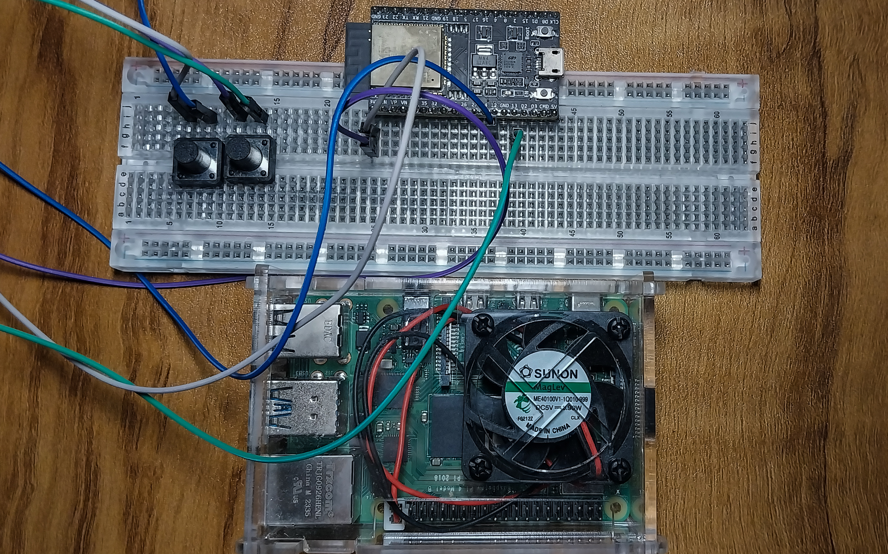

# RaspberryPI-ESP32 Remote PPT Display & Control System

A sophisticated presentation control system that enables wireless control of PowerPoint and PDF presentations using a Raspberry Pi and ESP32 combination. 

The system allows for remote control of presentations displayed on an external monitor or projector through a custom-built Bluetooth Low Energy (BLE) controller.



## Video Demonstration

Youtube: [Display and Remote Control PPTs using Raspberry Pi and ESP32 (Demonstration + GitHub Code and Tutorial)](https://youtu.be/fkQSearpJ4E)

## Features

- Wireless presentation control using ESP32 via BLE
- Support for PowerPoint (PPTX) and PDF presentations
- Real-time slide conversion and caching
- Fullscreen presentation mode
- Responsive GUI with presentation list and status indicators
- Automatic BLE reconnection handling
- Comprehensive logging system
- System service for automatic startup
- External display support

## Hardware Requirements


1. Raspberry Pi 4 Model B 4GB
2. ESP32-WROOM-32E DevKitC
3. 2x Tactile Push Buttons
4. External Display/Projector
5. Breadboard and jumper wires
6. Micro-USB cable for ESP32
7. Power supply for Raspberry Pi (I used power banks)
8. MicroSD card to store files on RPI

## Hardware Setup

### ESP32 Controller Setup
- 3V3 to 5V end of ESP32 placed on breadboard (j row)
- 2 Tactile 4-pin push buttons positioned spanning across midline.
- GPIO 12 connected to bottom right pin of one button.
- GPIO 13 connected to bottom right pin of other button.
- 3V3 connected to both upper right pins of both buttons.


### Raspberry Pi Setup
1. Connect Raspberry Pi to external display/projector via HDMI
2. Connect power supply
3. Ensure Raspberry Pi has network connectivity

## Software Requirements

### Raspberry Pi
- Raspberry Pi OS (Bullseye or newer)
- Python 3.8+
- LibreOffice (for PowerPoint conversion)
- X11 display server

### Python Dependencies
```
bluepy
tkinter
PyMuPDF
python-pptx
Pillow
```

### ESP32
- Code Found at [esp32_bt_ppt_slide_changer.ino](https://github.com/justavik/ESP32-Bluetooth-PPT-Slide-Changer/blob/main/esp32_bt_ppt_slide_changer.ino)
#### Upload Instructions
- Connect Data Transfer Cable from Micro-USB port of ESP32 to PC.
- Open Arduino IDE (downloaded from https://arduino.cc/en/software), create new sketch and paste esp32_bt_ppt_slide_changer.ino code.
- Add ESP32 support by going to File/Preferences and paste "https://raw.githubusercontent.com/espressif/arduino-esp32/gh-pages/package_esp32_index.json" in "Additional Boards Manager URLs".
- Install ESP32 board by Espressif Systems from Tools/Board/Boards Manager.
- Install ESP32-BLE-Keyboard library by downloading the ZIP (under green code button) from GitHub (https://github.com/T-vK/ESP32-BLE-Keyboard) and then Selecting the ZIP file from Sketch/Include Library/Add .ZIP Library... in the IDE.
- Find and connect port from Tools/Port (CMO in Windows or /dev/ttyUSB0 in Linux).
- Set upload speed to 115200 from Tools/Upload Speed.
- Start Upload (click -> in IDE).

## Software Setup

### 1. Raspberry Pi Configuration

1. Install system dependencies:
   ```bash
   sudo apt update
   sudo apt install -y python3-pip python3-venv python3-tk libreoffice
   sudo apt install -y bluetooth bluez libbluetooth-dev
   ```

2. Create and setup Python virtual environment:
   ```bash
   mkdir ~/ppt_controller
   cd ~/ppt_controller
   python3 -m venv venv
   source venv/bin/activate
   pip install bluepy PyMuPDF python-pptx Pillow
   ```

3. Create necessary directories:
   ```bash
   sudo mkdir /var/log/presentation
   sudo chown $USER:$USER /var/log/presentation
   mkdir ~/presentations  # For storing presentation files
   ```

4. Configure system service:
   ```bash
   sudo cp presentation.service /etc/systemd/system/
   sudo systemctl daemon-reload
   sudo systemctl enable presentation
   sudo systemctl start presentation
   ```

### 2. ESP32 Configuration

1. Install Arduino IDE and ESP32 board support
2. Open `rpiesp32.ino` in Arduino IDE
3. Update the following in the code:
   - Set your custom SERVICE_UUID
   - Set your custom CHARACTERISTIC_UUID
4. Upload code to ESP32

## Project Files

```
.
├── rpiesp32.ino              # ESP32 BLE controller code
├── presentation_controller.py # Main Python application
├── presentation.service      # Systemd service file
├── start_display.sh         # Display setup script
└── run_presentation.sh      # Presentation launcher script
```

## Usage Instructions

1. Power up the ESP32 controller
2. Place your presentation files (PPT/PPTX/PDF) in `~/presentations/`
3. The system will automatically start on Raspberry Pi boot
4. Use the ESP32 controller buttons:
   - UP Button: Previous slide
   - DOWN Button: Next slide
   - Long Press (either button): Select/Exit presentation
   - ESC key: Toggle fullscreen mode

## Troubleshooting

1. If BLE connection fails:
   - Check ESP32 power
   - Verify MAC address in configuration
   - Restart Bluetooth service: `sudo systemctl restart bluetooth`

2. If display issues occur:
   - Check HDMI connection
   - Verify display configuration in Raspberry Pi settings
   - Check X11 display permissions

3. Log files location:
   - Main application: `/var/log/presentation/debug.log`
   - Service logs: `/var/log/presentation_service.log`
   - Error logs: `/var/log/presentation_error.log`

## Security Considerations

- The system uses BLE security features
- X11 display permissions are restricted to local users
- Service runs under user context, not root
- Logging is configured to prevent disk space issues

## License

This project is licensed under the MIT License - see the LICENSE file for details.
